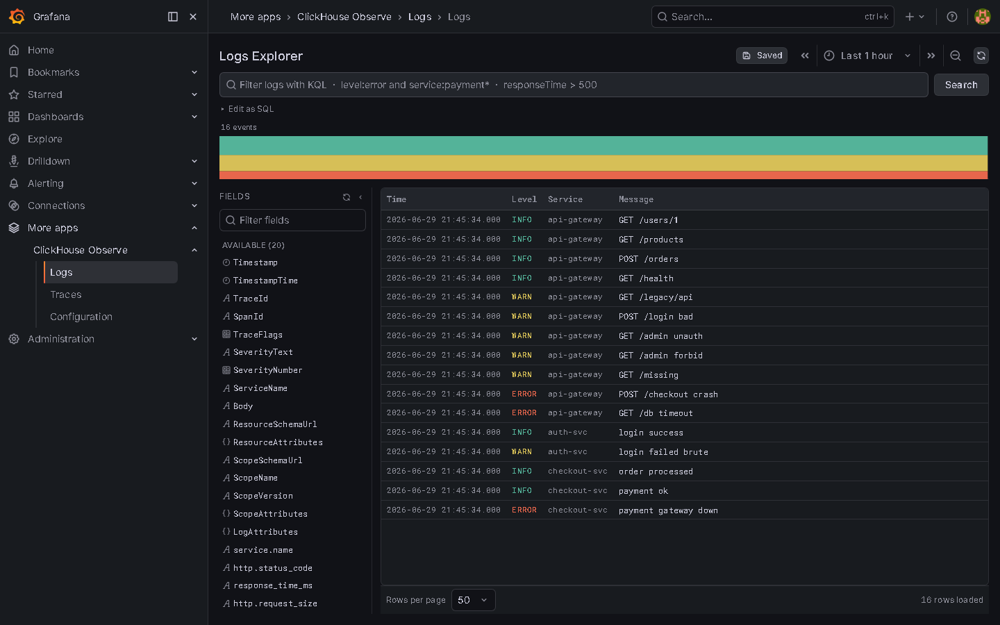
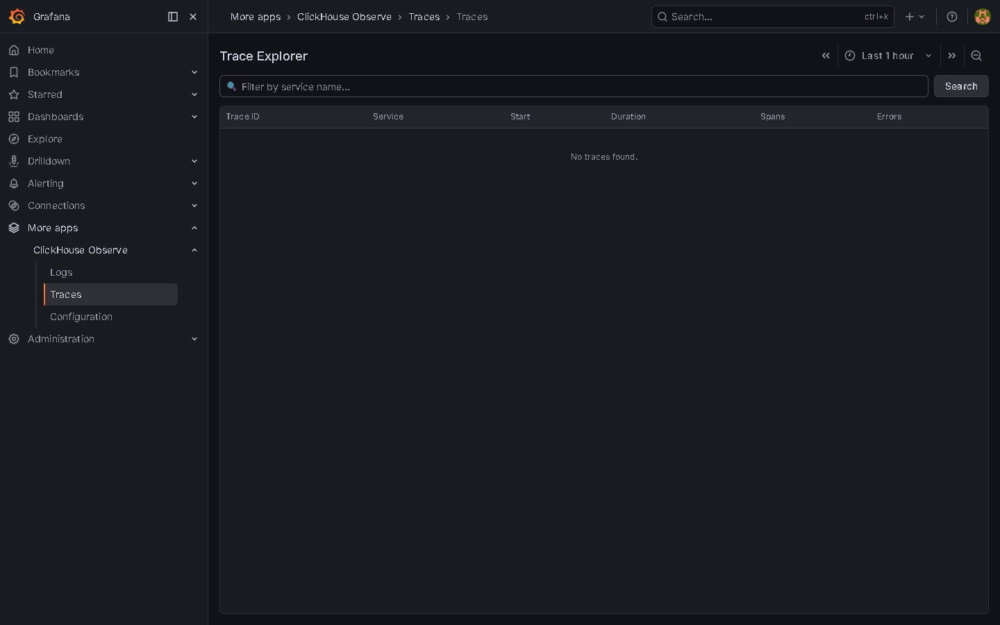
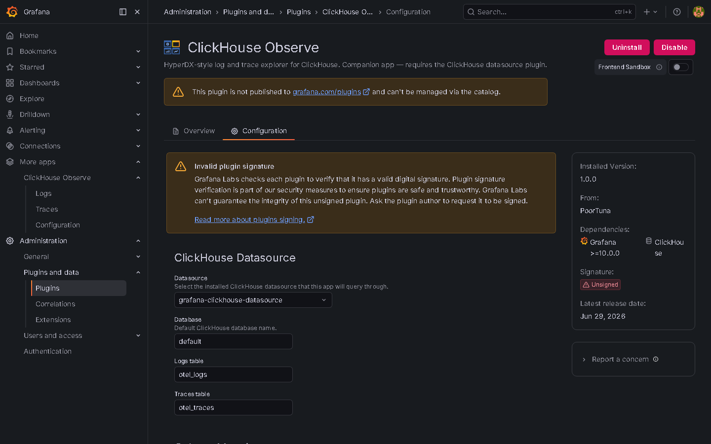

# ClickHouse Observe

HyperDX-style log and trace explorer for ClickHouse, packaged as a Grafana app plugin.



---

## Requirements

- Grafana >= 10.0.0
- [ClickHouse datasource plugin](https://grafana.com/grafana/plugins/grafana-clickhouse-datasource/) installed and configured
- A ClickHouse table with log data (the OpenTelemetry schema works out of the box)
- Node >= 22 (development only)

---

## Features

### Logs Explorer

A full-page log search view backed directly by ClickHouse SQL.

- **KQL search bar** — Kibana Query Language with autocomplete. Field names, operators, and top values are all suggested as you type, fetched live from ClickHouse.
- **Volume histogram** — log volume over time, bucketed by severity level. Click and drag to zoom into a time range.
- **Field sidebar** — auto-discovered from `system.columns` plus Map-key introspection. Click a field to add it as a table column or filter. Per-field value distribution popover available on hover.
- **Sortable, reorderable columns** — add columns from the sidebar, remove them from the header, drag to reorder.
- **Row detail drawer** — click any row to see all fields. One-click "filter for" / "filter out" on any value. If the row carries a trace ID, a link opens the corresponding trace in the Traces Explorer.
- **Filter pills** — active filters displayed as dismissable chips. Supports `=`, `!=`, `contains`, `not contains`.
- **Hybrid pagination** — initial 200-row buffer with lazy fetch as you page past it. Page size is configurable (10 – 500 rows per page).
- **Edit as SQL** — toggle to drop into raw ClickHouse SQL for full query control.
- **Saved searches** — save and restore any combination of KQL query, filters, columns, sort, and time range. Stored in browser localStorage.
- **Browser-local timestamps** — log timestamps are rendered in the browser's local timezone.


### Trace Explorer



Search traces by service name and inspect individual traces as a span waterfall.

- **Trace list** — table of recent traces showing trace ID, root service, start time, duration, span count, and error count.
- **Span waterfall** — click any trace to open a timeline view of all spans, with hierarchy, duration bars, and status codes.
- **Deep links** — traces are addressable by URL (`/a/poortuna-clickhouse-observe-app/traces/<traceId>`). The Logs Explorer links here directly when a log row carries a trace ID.

### Configuration



The configuration page is at **Administration > Plugins > ClickHouse Observe > Configuration**.

- Pick the ClickHouse datasource to query through.
- Set the database name and the logs/traces table names.
- Map columns to their roles (timestamp, body, severity, trace/span IDs, service name, duration, attribute Maps).
- **Apply OTel preset** fills in all column names for the standard OpenTelemetry Collector schema (`otel_logs` / `otel_traces`). Override individual fields below the preset button for custom schemas.

---

## KQL Search Reference

| Syntax | Meaning |
|--------|---------|
| `level:error` | Field equals value (exact match) |
| `service:payment*` | Wildcard match |
| `service:*` | Field exists |
| `"payment failed"` | Phrase match on the log body |
| `responseTime > 500` | Numeric greater-than |
| `responseTime >= 500` | Numeric greater-than-or-equal |
| `responseTime < 100` | Numeric less-than |
| `responseTime <= 100` | Numeric less-than-or-equal |
| `level:error and service:checkout` | Boolean AND |
| `level:warn or level:error` | Boolean OR |
| `not level:debug` | Boolean NOT |
| `level:error and service:pay* and latency > 1000` | Combined |

Bare terms without a field (`payment failed`) search the log body. Autocomplete suggests field names, operators, and live top values at each position.

---

## Configuration Steps

1. Install and configure the [ClickHouse datasource plugin](https://grafana.com/grafana/plugins/grafana-clickhouse-datasource/) with your ClickHouse connection details. Credentials live on the datasource, not on this app.
2. Build and copy (or run in dev mode — see below) this plugin so Grafana loads it.
3. In Grafana, go to **Administration > Plugins**, find **ClickHouse Observe**, and click **Enable**.
4. Open **Administration > Plugins > ClickHouse Observe > Configuration**.
5. Select the ClickHouse datasource from the dropdown.
6. Enter the database name (default: `default`), logs table, and traces table.
7. Click **Apply OTel preset** if your tables follow the OpenTelemetry Collector schema. Otherwise fill in the column mapping fields manually.
8. Click **Save configuration**. The page reloads to apply the new settings.
9. Navigate to **More apps > ClickHouse Observe > Logs** to start querying.

---

## Development

```bash
# Install dependencies
npm install

# Build in development mode (watch)
npm run dev

# Build for production
npm run build

# Run unit tests (KQL parser, suggest, SQL generation)
npm run test:ci

# Check types
npm run typecheck

# Lint
npm run lint

# Start a local Grafana instance via Docker (plugin hot-reloads)
npm run server

# Run end-to-end tests (requires npm run server to be running)
npm run e2e
```

The Docker dev environment (`npm run server`) runs Grafana with unsigned plugin loading enabled and mounts the built `dist/` directory into the container. No signing is required for local development.

---

## Project Layout

| Path | Contents |
|------|----------|
| `src/pages/` | Top-level page components: `LogsExplorer.tsx`, `TraceExplorer.tsx` |
| `src/components/` | Shared UI: `SearchBar`, `LogsTable`, `LogDetailDrawer`, `VolumeHistogram`, `TraceWaterfall`, `FilterPills`, `PaginationBar` |
| `src/components/FieldSidebar/` | Field discovery sidebar, per-field stats popover |
| `src/components/AppConfig/` | Plugin configuration page |
| `src/sql/` | SQL generation: `queryBuilder.ts`, `filters.ts`, `fields.ts`, `introspection.ts` |
| `src/sql/kql/` | KQL engine: lexer, parser, AST, SQL emitter, autocomplete suggestions, value loader |
| `src/data/` | Data layer: `runQuery.ts` (Grafana datasource proxy), `savedSearches.ts` (localStorage) |

---

## Signing and Distribution

Plugins must be signed before they can be distributed via the Grafana plugin catalog or used in environments with signature enforcement. See the [Grafana plugin signing documentation](https://grafana.com/developers/plugin-tools/publish-a-plugin/sign-a-plugin) for instructions. The `npm run sign` script wraps `@grafana/sign-plugin` and requires a `GRAFANA_API_KEY` environment variable from a Grafana Cloud account whose slug matches the plugin ID prefix (`poortuna`).

---

**License:** Apache-2.0
